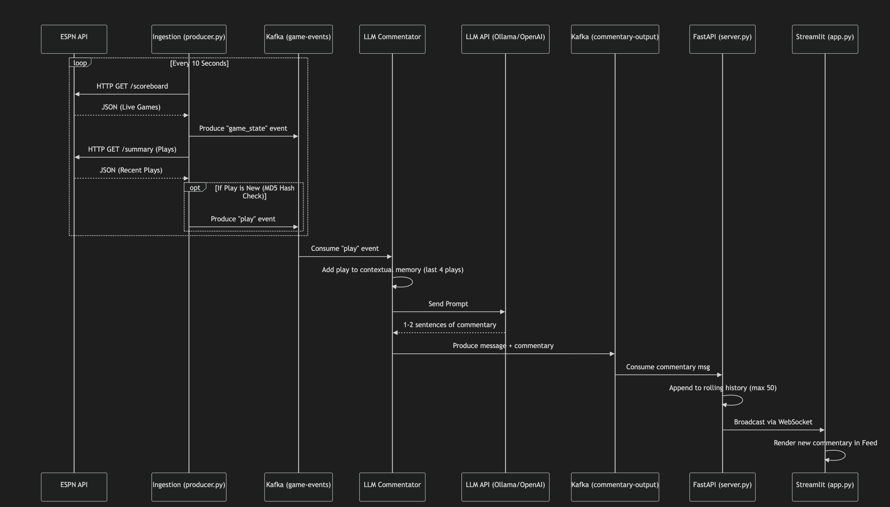

# Real Time AI Sports Commentary Engine

## Project Summary

Welcome to the Real Time AI Sports Commentary Engine. This project is a fully automated broadcasting system that monitors live sports games, understands the context of the plays, and generates dynamic and engaging commentary on the fly using Artificial Intelligence. By tapping into live box scores and play by play events, the system evaluates the game momentum and injects intelligent predictions, exactly like a real sports television broadcast. It even calculates a live home team win probability and assigns a hype score to every play to ensure the tone of the generated commentary perfectly matches the excitement on the court or field.

## Tech Stack Explained

Let us break down the technology powering this application.

* Python: We use Python as the central programming language for all microservices, data extraction, and machine learning integrations.
* Apache Kafka: This acts as the central central nervous system. It is a distributed event streaming platform that allows our independent scripts to publish and subscribe to data feeds concurrently without blocking each other.
* Zookeeper: This operates alongside Kafka to manage the cluster metadata and maintain synchronization.
* FastAPI: A blazing fast modern web framework we use to serve both the API endpoints and the native web dashboard.
* HTML and plain JS: Our customized frontend framework. It allows us to build beautiful, reactive data dashboards directly on top of the API server without external frameworks.
* Large Language Models: The brain of the operation. By passing structured prompts to models like Anthropic Claude, OpenAI, or local Ollama deployments, we generate the actual commentary text and analytical data.

## Orchestration

Running a multi layered streaming architecture requires proper orchestration. Instead of running everything in a single script, we separate our logic into distinct microservices. 

To keep the infrastructure simple, the message brokers (Kafka and Zookeeper) are containerized using Docker Desktop. You can spin them up instantly using the docker compose command. 

Once the data brokers are alive, you run four independent Python processes.

1. The Ingestion Engine.
2. The Streaming Enricher.
3. The LLM Commentator.
4. The Unified API Server and Dashboard.

This decoupled orchestration allows the system to scale infinitely. If you wanted to monitor ten games at once, you would simply spin up more ingestion producers without needing to restart the frontend dashboard or the API.

## Whole Workflow Explained

Here is exactly how data travels through the system from the real world to your screen. Below is a detailed sequence diagram breaking down the underlying process.

First, the Ingestion Producer wakes up periodically and polls the public sports APIs for live play by play updates. Whenever it spots a new event, it formats it into a standard JSON payload and publishes it directly to the first Kafka topic.

Second, the Streaming Enricher listens to that topic. It acts as an intermediary memory bank. It stores recent plays, calculates the time differentials, and builds a comprehensive contextual window. Once it enriches the raw event with this historical context, it forwards it to the next queue.

Next, the LLM Commentator picks up the enriched event. It builds an incredibly strict system prompt instructing the Artificial Intelligence to adopt the persona of a sports broadcaster. The model reads the play, understands the current score gap, and outputs a structured response containing the generated commentary, a hype score from one to ten, and the predicted win probability. This final package is then pushed to the output Kafka topic.

Meanwhile, our FastAPI server sits in the background operating a background thread that constantly consumes that output topic. Whenever the LLM publishes new commentary, the API server catches it and immediately broadcasts it out over WebSockets to any connected clients.

Finally, the Native Web Dashboard receives the WebSocket payload in real time. It updates the live score, seamlessly adjusts the animated win probability progress bar based on the incoming data, and pushes the new commentary card onto the top of the feed with appropriate color coding. 

## Getting Started

Follow these steps to launch the engine locally.

Ensure you have your virtual environment activated and all Python requirements installed via pip.

Launch your Docker daemon and bring the Kafka cluster online using the docker compose command.

Populate your environment variables with your chosen LLM provider credentials. 

Run the ingestion producer, the context enricher, the commentator, and the unified server concurrently in separate terminal windows. 

Navigate to your local host on port 8000 to enjoy the broadcast.
